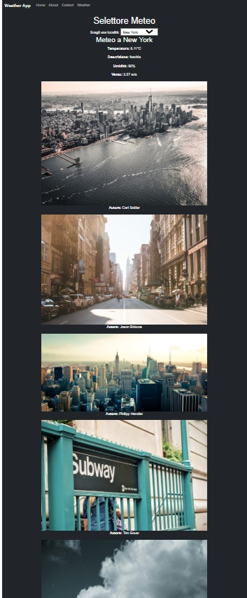

<!DOCTYPE html>
<html lang="en">
<head>
  <meta charset="UTF-8">
  <meta name="viewport" content="width=device-width, initial-scale=1.0">
</head>
<body>
  <h1>🌤️ Weather Selector App</h1>
  
Benvenuto nell'app <strong>Weather Selector</strong>! 🚀 Questa applicazione ti consente di:

  <ul>
    <li>🌍 Selezionare una località da una lista predefinita.</li>
    <li>🖼️ Visualizzare immagini della località selezionata grazie all'API di Unsplash.</li>
    <li>☁️ Visualizzare le informazioni meteo della località tramite l'API di OpenWeatherMap.</li>
  </ul>

  <h2>📦 Funzionalità</h2>
  <ul>
    <li>🔎 Ricerca immagini della località selezionata.</li>
    <li>📊 Informazioni meteo, tra cui:
      <ul>
        <li>🌡️ Temperatura attuale.</li>
        <li>🌦️ Descrizione delle condizioni meteorologiche.</li>
        <li>💧 Umidità.</li>
        <li>🌬️ Velocità del vento.</li>
      </ul>
    </li>
    <li>🔗 Collegamenti diretti alle immagini su Unsplash.</li>
  </ul>

  <h2>⚙️ Configurazione</h2>
  
Segui questi passaggi per configurare e avviare l'app:

  <ol>
    <li>Clona il repository nel tuo ambiente locale:
      <pre><code>git clone https://github.com/tuo-repo/weather-selector-app.git</code></pre>
    </li>
    <li>Installa le dipendenze con il seguente comando:
      <pre><code>npm install</code></pre>
    </li>
    <li>Ottieni le tue chiavi API:
      <ul>
        <li>🔑 <strong>Unsplash API</strong>: Registrati su <a href="https://unsplash.com/developers" target="_blank">Unsplash Developers</a>.</li>
        <li>🔑 <strong>OpenWeatherMap API</strong>: Registrati su <a href="https://openweathermap.org/" target="_blank">OpenWeatherMap</a>.</li>
      </ul>
    </li>
    <li>Configura le chiavi API nel file <code>WeatherSelector.jsx</code>:
      <pre><code>const unsplashAccessKey = "YOUR_UNSPLASH_ACCESS_KEY";
const weatherApiKey = "YOUR_WEATHER_API_KEY";</code></pre>
    </li>
    <li>Avvia l'app con il comando:
      <pre><code>npm start</code></pre>
    </li>
  </ol>

  <h2>🖥️ Utilizzo</h2>
  
Per utilizzare l'app:

  <ol>
    <li>Seleziona una località dal menu a tendina.</li>
    <li>Fai clic sul pulsante "Cerca Meteo e Immagini".</li>
    <li>Guarda le immagini e il meteo della località selezionata. 🌟</li>
  </ol>

  <h2>📸 Screenshot</h2>
  
Ecco un'anteprima dell'app:

  

  <h2>📜 Licenza</h2>
  
Questo progetto è distribuito sotto la licenza <strong>MIT</strong>. Puoi trovare maggiori dettagli nel file <code>LICENSE</code>.

  <h2>💬 Contatti</h2>
  
Hai domande o suggerimenti? Contattami su:

  <ul>
    <li>📧 Email: <a href="mailto:tuo-email@example.com">tuo-email@example.com</a></li>
    <li>🐙 GitHub: <a href="https://github.com/tuo-username" target="_blank">tuo-username</a></li>
  </ul>

  <footer style="margin-top: 20px; border-top: 1px solid #ddd; padding-top: 10px; font-size: 0.9em; color: #555;">
    
Creato con ❤️ da <strong>Tuo Nome</strong>.

  </footer>
</body>
</html>
